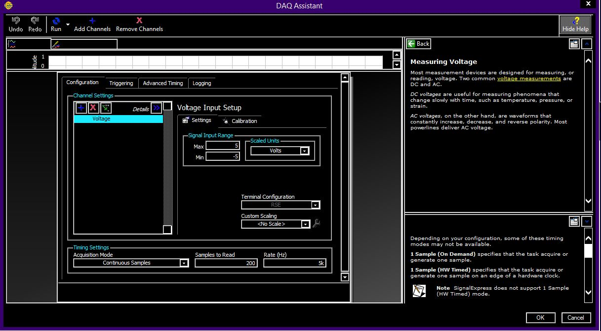

# Real-Time BPM Monitoring System using NI USB-6211 💓📊

## 📖 Overview
This project is a real-time Heart Rate (BPM) monitoring system developed using **National Instruments LabVIEW** and the **NI USB-6211** Data Acquisition (DAQ) device.

The system acquires raw analog signals from an optical pulse sensor, performs signal conditioning (filtering) to remove noise, and executes a peak-detection algorithm to calculate the Beats Per Minute (BPM) instantly.

## ⚙️ DAQ Configuration
Below is the configuration used for the **NI USB-6211**. This setup ensures the analog input channel (AI0) is reading the correct voltage range and sampling rate from the pulse sensor.

## 📸 Working Project (Full View)
To see the full LabVIEW Virtual Instrument (VI) in action, including the real-time graph and the calculated BPM output, view the PDF below. This document captures the complete system state during operation.

👉 **[Click here to view the Full Working Project (PDF)](Working_Project.pdf)**

## 🛠️ Hardware Used
* **DAQ Device:** NI USB-6211 (Bus-Powered Multifunction DAQ)
* **Sensor:** Optical Pulse Sensor (Standard 5V/3.3V Analog Output)
* **Wiring:** Sensor output connected to Analog Input 0 (AI0)

## 💻 Software Requirements
* **LabVIEW** (Developed on version 2015)
* **NI-DAQmx Driver** (Essential for communicating with the USB-6211)

## 🚀 How to Run
1.  Clone this repository.
2.  Connect the NI USB-6211 to your PC via USB.
3.  Wire the Pulse Sensor Signal pin to **AI0** on the DAQ.
4.  Open the `.vi` file in LabVIEW.
5.  Select your device (e.g., `Dev1`) from the DAQmx channel dropdown.
6.  Click the **Run** arrow.

## 👥 Contributors
* **[Nalinakshan]**
* **[Shriniwas]**

---
*This project is open-source. Feel free to use the code for learning or educational purposes.*
